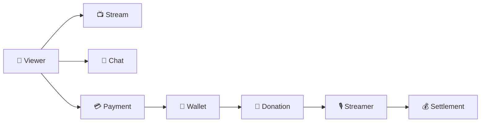

<div align="center">

# ⚡ RAIO Project

### Backend Engineering × AI × Scalable Architecture

**기술을 사용하는 것에 그치지 않고,  
직접 설계하고 구축하며 함께 성장합니다.**

</div>

<br/>

> ### 👋 우리는 이런 팀입니다.
>
> 일반적인 **Backend Engineering**을 기반으로  
> **AI를 개발 과정과 서비스에 활용하고 구축하며 팀의 성장을 만들어가는 개발팀**입니다.

<br/>

<table>
<tr>
<td width="12%" align="center">

### 🚀

</td>
<td width="88%">

### 기술을 따라가는 팀보다, 기술을 이해하고 선택할 수 있는 팀을 지향합니다.

*We build, learn, and scale together.*

</td>
</tr>
</table>

<br/>

<details>
<summary><b>👀 RAIO가 추구하는 Engineering Culture</b></summary>

<br/>

우리는 단순히 기능을 빠르게 구현하는 것만을 목표로 하지 않습니다.

**왜 이 기술을 사용하는지, 왜 이런 구조를 선택했는지**를 함께 고민하고  
그 과정에서 얻은 경험을 팀의 기술 자산으로 축적합니다.

- 새로운 기술을 직접 사용하고 검증합니다.
- AI를 개발 생산성과 서비스에 적극적으로 활용합니다.
- 기술 선택의 이유를 설명할 수 있는 엔지니어링을 지향합니다.
- 개인의 경험을 팀의 기술 자산으로 축적합니다.
- 서비스의 성장뿐 아니라 개발자의 성장을 중요하게 생각합니다.

</details>

---

# 🏗️ Architecture

> ### Architecture should grow with the Service and the Team.
>
> **서비스와 팀의 성장에 따라 함께 성장할 수 있는 아키텍처를 설계합니다.**

RAIO는 처음부터 복잡한 MSA를 구성하지 않습니다.

초기에는 **Monolith / Monorepo**의 생산성을 활용하면서  
각 비즈니스의 **Domain Boundary**를 명확하게 유지합니다.

<br/>

<div align="center">

**Package　→　Module　→　Runtime　→　Service　→　Repository**

</div>

<br/>

<table>
<tr>
<td width="12%" align="center">

### 🧩

</td>
<td width="88%">

### 처음부터 분리하지 않습니다.

현재 규모에 가장 적합한 구조에서 시작하고,  
**필요한 순간에 분리할 수 있는 경계**를 먼저 설계합니다.

</td>
</tr>
</table>

<details>
<summary><b>🏛️ Architecture Direction 자세히 보기</b></summary>

<br/>

### Domain First

Layer보다 **Domain을 중심으로 관련 코드를 응집**시키고  
각 Domain 내부에서 Hexagonal Architecture를 유지합니다.

```text
payment-service
│
├── payment
│   ├── domain
│   ├── application
│   └── adapter
│
├── wallet
│   ├── domain
│   ├── application
│   └── adapter
│
└── settlement
    ├── domain
    ├── application
    └── adapter
```

이를 통해 다음을 지향합니다.

`High Cohesion` · `Low Coupling` · `Clear Boundary` · `Easy Extraction`

### Business & Runtime Separation

비즈니스 기능과 실행 환경을 서로 다른 관심사로 바라봅니다.

```text
        Business Capability

Payment · Wallet · Settlement · Stream
                 │
                 │ UseCase
                 ▼
──────────────────────────────────
                 ▲
                 │
    Online · Batch · Consumer

               Runtime
```

**Domain은 무엇을 수행할지 정의하고,  
Runtime은 어떻게 실행할지를 결정합니다.**

### Growing Architecture

```text
Monolith / Monorepo
        │
        ▼
  Domain Boundary
        │
        ▼
      Module
        │
        ▼
      Runtime
        │
        ▼
      Service
        │
        ▼
    Repository
        │
        ▼
 Independent Team
```

서비스와 조직의 규모가 성장하면  
Package → Module → Runtime → Service → Repository 단위로 점진적으로 분리합니다.

</details>

<br/>

---

# 🚀 Our Projects

> **아이디어를 실제 서비스로 만들며 기술을 검증합니다.**

<br/>

<table>
<tr>
<td width="50%" valign="top">

## 📡 RAIO Streaming

### Social Live Streaming Platform

시청자와 스트리머가 **실시간 방송, 채팅, 후원**을 통해  
상호작용하는 Social Streaming Platform입니다.

<br/>

**💡 Core**

`Streaming` `Chat` `Donation`  
`Payment` `Wallet` `Settlement`

<br/>

**⚙️ Backend**

`Java 21` `Spring Boot 3`  
`JPA` `QueryDSL` `Spring Batch`

<br/>

**🗄️ Data**

`PostgreSQL` `Redis` `Flyway`

<br/>

**🔌 Communication**

`REST` `gRPC`

<br/>

**☁️ Infrastructure**

`Docker` `Railway` `GitHub Actions`  
`Prometheus` `Grafana`

<br/>

### → [Explore Backend Repository](https://github.com/RAIO-Project/raio-backend)

</td>

<td width="50%" valign="top">

## 🤖 AI Project

### AI × Backend Engineering

AI를 단순한 개발 도구를 넘어  
**실제 서비스의 구성 요소로 활용하는 방법을 탐구합니다.**

<br/>

**💡 Focus**

`AI` `Backend`  
`Automation` `Productivity`

<br/>

**🧪 Status**

새로운 프로젝트를 준비하고 있습니다.

<br/><br/><br/><br/><br/><br/>

### → Coming Soon

</td>
</tr>
</table>

<br/>

<details>
<summary><b>📡 RAIO Streaming Platform 자세히 보기</b></summary>

<br/>

## 🎬 Platform Flow



### Core Domains

| Domain | Responsibility |
|---|---|
| 👤 **User** | 회원 및 사용자 정보 |
| 📺 **Stream** | 방송 및 스트리밍 상태 |
| 💬 **Chat** | 실시간 채팅 |
| 🎁 **Donation** | 시청자와 스트리머 간 후원 |
| 💳 **Payment** | 결제 및 포인트 충전 |
| 👛 **Wallet** | 포인트 잔액 및 거래 이력 |
| 💰 **Settlement** | 스트리머 수익 집계 및 정산 |

### 💰 Payment → Donation → Settlement

```text
Payment
   │
   ▼
Wallet
   │
   ▼
Donation
   │
   ▼
Streamer Revenue
   │
   ▼
Settlement
```

RAIO에서는 **Payment와 Settlement를 서로 다른 비즈니스 영역**으로 바라봅니다.

> **Payment**  
> 사용자가 플랫폼에 돈을 지불하는 과정
>
> **Settlement**  
> 플랫폼이 스트리머에게 지급해야 할 금액을 계산하는 과정

실제 송금은 Settlement의 책임에서 제외하며,  
향후 필요한 경우 별도의 **Payout / Transfer Domain**으로 확장할 수 있도록 설계합니다.

</details>

---

<div align="center">

### ⚡ RAIO Project

**Build together · Learn together · Scale together**

`Backend`　·　`Architecture`　·　`AI`　·　`Streaming`

</div>
