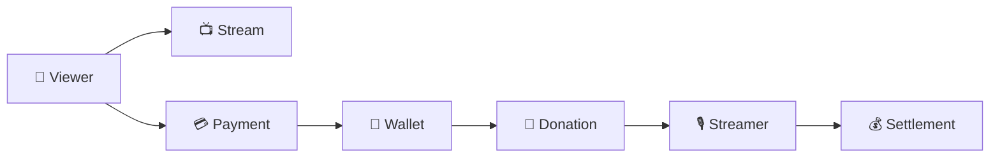

<div align="center">

# ⚡ RAIO

### Build · Learn · Scale

**Backend Engineering × AI × Scalable Architecture**

일반적인 Backend Engineering을 기반으로  
**AI를 개발과 서비스에 활용하며 함께 성장하는 개발팀입니다.**

<br/>

</div>

---

## 👋 About Us

RAIO는 단순히 기능을 구현하는 것보다  
**왜 이렇게 설계하는지 고민하고, 그 경험을 팀의 기술로 축적하는 것**을 중요하게 생각합니다.

AI를 개발 생산성을 높이는 도구로 활용하는 동시에,  
직접 서비스에 적용하고 구축하며 새로운 가능성을 탐구합니다.

<details>
<summary><b>🏗️ 우리가 지향하는 Backend Architecture</b></summary>

<br/>

RAIO는 처음부터 복잡한 Microservice Architecture를 구성하지 않습니다.

초기에는 **개발 생산성과 운영 효율성을 위해 Monolith / Monorepo로 시작**하되,  
각 비즈니스의 **Domain Boundary를 명확하게 유지**합니다.

서비스와 조직이 성장하면 필요한 경계를 단계적으로 분리합니다.

```text
Package
   ↓
Module
   ↓
Runtime
   ↓
Service
   ↓
Repository
```

### Architecture Principles

- Domain Driven Design
- Hexagonal Architecture
- Package by Domain
- High Cohesion / Low Coupling
- Business & Runtime Separation
- Modular Monolith → Microservices

### Package by Domain

하나의 서비스 내부에서도 Layer보다 **Domain을 중심으로 코드를 응집**합니다.

```text
payment-service
│
├── payment
│   ├── domain
│   ├── application
│   └── adapter
│
├── wallet
│   ├── domain
│   ├── application
│   └── adapter
│
└── settlement
    ├── domain
    ├── application
    └── adapter
```

각 Domain 내부에서는 Hexagonal Architecture를 유지합니다.

### Business & Runtime Separation

비즈니스 기능과 실행 환경 역시 서로 다른 관심사로 바라봅니다.

```text
Business Capability

Payment · Wallet · Settlement
            │
            │ UseCase
            ▼
─────────────────────────────
            ▲
            │
Online · Batch · Consumer

Runtime
```

Domain은 **무엇을 수행하는지**를 정의하고,  
Runtime은 **어떻게 실행할지**를 결정합니다.

이를 통해 동일한 Application / Domain을 Online, Batch, Consumer 등
다양한 실행 환경에서 사용할 수 있도록 설계합니다.

### Growing Architecture

```text
Monolith / Monorepo
        ↓
Domain Boundary
        ↓
Package
        ↓
Module
        ↓
Runtime
        ↓
Service
        ↓
Repository
        ↓
Independent Team
```

> **Architecture should grow with the Service and the Team.**

처음부터 시스템을 분산시키는 것이 아니라,  
**필요할 때 분리할 수 있는 구조를 만드는 것**을 목표로 합니다.

</details>

<br/>

---

# 🚀 Projects

RAIO에서 개발하고 있는 서비스입니다.

<br/>

<table>
<tr>

<td width="50%" valign="top">

### 📡 RAIO Streaming

**Social Live Streaming Platform**

실시간 방송을 중심으로 시청자와 스트리머가  
채팅과 후원을 통해 상호작용하는 스트리밍 플랫폼입니다.

<br/>

**Core Domain**

`User` `Stream` `Chat` `Donation`  
`Payment` `Wallet` `Settlement`

<br/>

**Backend**

`Java 21` `Spring Boot 3` `JPA`  
`PostgreSQL` `Redis` `gRPC` `Spring Batch`

<br/>

**Infrastructure**

`Docker` `Railway` `GitHub Actions`  
`Prometheus` `Grafana`

<br/>

➡️ **[Backend Repository](https://github.com/RAIO-Project/raio-backend)**

</td>

<td width="50%" valign="top">

### 🤖 Next Project

**AI Powered Service**

Backend Engineering과 AI를 결합하여  
새로운 서비스 경험을 만드는 프로젝트를 준비하고 있습니다.

<br/>

**Focus**

`AI` `Backend` `Automation`  
`Productivity`

<br/><br/>

> Coming Soon

</td>

</tr>
</table>

<br/>

<details>
<summary><b>📡 RAIO Streaming Architecture 자세히 보기</b></summary>

<br/>

### Streaming Flow



### Core Domains

| Domain | Responsibility |
|---|---|
| 👤 **User** | 회원 및 사용자 정보 |
| 📺 **Stream** | 방송 및 스트리밍 상태 |
| 💬 **Chat** | 실시간 채팅 |
| 🎁 **Donation** | 시청자 → 스트리머 후원 |
| 💳 **Payment** | 결제 및 포인트 충전 |
| 👛 **Wallet** | 포인트 잔액 및 거래 이력 |
| 💰 **Settlement** | 스트리머 수익 집계 및 정산 |

### Payment Flow

```text
Viewer
   │
   ▼
Payment
   │
   ▼
Wallet
   │
   ▼
Donation
   │
   ▼
Streamer Revenue
   │
   ▼
Settlement
```

RAIO에서는 **Payment와 Settlement를 서로 다른 비즈니스 영역**으로 바라봅니다.

```text
Payment
→ 사용자가 플랫폼에 돈을 지불하는 과정

Settlement
→ 플랫폼이 스트리머에게 지급해야 할 금액을 계산하는 과정
```

실제 지급은 Settlement의 책임으로 두지 않으며,  
향후 필요한 경우 별도의 `Payout / Transfer` 영역으로 확장합니다.

### Backend Architecture

```text
                   Driving Adapter
                REST / gRPC / Batch
                         │
                         ▼
                    Application
                    UseCase / Port
                         │
                         ▼
                       Domain
                         │
                         ▼
                     Out Port
                         │
                         ▼
                    Driven Adapter
             PostgreSQL / Redis / External
```

Application과 Domain이 특정 실행 환경에 종속되지 않도록 설계합니다.

</details>

---

## 🛠 Technology

<div align="center">

**Backend**

`Java` · `Spring Boot` · `Spring Batch` · `JPA` · `QueryDSL`

**Data**

`PostgreSQL` · `Redis` · `Flyway`

**Communication**

`REST` · `gRPC`

**Infrastructure**

`Docker` · `Railway` · `GitHub Actions`

**Observability**

`Prometheus` · `Grafana`

</div>

---

<div align="center">

### ⚡ RAIO Project

**Build together · Learn together · Scale together**

</div>
