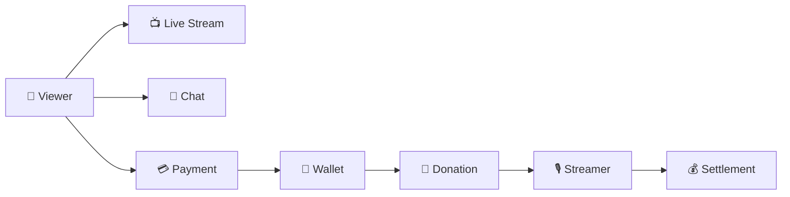

<div align="center">

# ⚡ RAIO Project

### Build, Learn, Scale with AI

**Backend Engineering × AI × Scalable Architecture**

RAIO Project는 백엔드 엔지니어링을 기반으로  
**AI 기술을 개발 과정과 서비스에 활용하고 직접 구축하며 함께 성장하는 팀**입니다.

</div>

---

## 👋 About RAIO Project

RAIO Project는 단순히 서비스를 구현하는 것을 넘어  
**왜 이렇게 설계해야 하는지 고민하고, 그 과정에서 얻은 경험과 기술을 함께 축적하는 것**을 중요하게 생각합니다.

일반적인 Backend Engineering을 기반으로 AI 기술을 개발 과정에 적극적으로 활용하여  
개발 생산성을 높이고, AI를 활용한 새로운 서비스와 기술적 가능성을 탐구합니다.

> **Build together, Learn together, Scale together.**

---

# 🏗️ Architecture Direction

RAIO는 처음부터 복잡한 Microservice Architecture를 구성하지 않습니다.

초기에는 **개발 생산성과 운영 효율성을 위해 Monolith / Monorepo 구조로 시작**하되,  
각 비즈니스의 **Domain Boundary를 명확하게 유지**합니다.

서비스와 조직의 규모가 성장하면 필요한 경계를 단계적으로 분리할 수 있도록 설계합니다.

```text
Package
   ↓
Module
   ↓
Runtime
   ↓
Service
   ↓
Repository
```

### 🌱 Small Team

초기에는 하나의 Repository와 Runtime을 중심으로 빠르게 개발합니다.

```text
Monorepo
└── Modular Monolith
```

불필요한 분산 시스템의 복잡성을 만들기보다  
비즈니스 개발과 도메인 설계에 집중합니다.

### 📈 Growing Service

서비스가 성장하면 각 비즈니스의 Domain Boundary를 기준으로 책임을 분리합니다.

```text
Domains
├── User
├── Stream
├── Chat
├── Donation
├── Payment
├── Wallet
└── Settlement
```

각 도메인은 자신의 비즈니스 책임을 가지며  
다른 도메인의 내부 구현에 강하게 의존하지 않는 것을 지향합니다.

### 🏢 Growing Organization

서비스와 팀의 규모가 충분히 성장하면  
도메인을 독립적인 Module / Runtime / Service / Repository로 점진적으로 분리할 수 있습니다.

```text
RAIO
│
├── User Team
├── Streaming Team
├── Payment Team
└── Settlement Team
```

> **처음부터 분산시키는 것이 아니라, 필요할 때 분리할 수 있도록 설계합니다.**

---

# 📡 RAIO Streaming Platform

RAIO는 **실시간 방송을 중심으로 시청자와 스트리머가 상호작용하는 Social Streaming Platform**입니다.

단순히 영상을 송출하고 시청하는 것을 넘어  
스트리밍 서비스에서 발생하는 다양한 사용자 경험과 비즈니스 흐름을 직접 설계하고 구현합니다.

### Core Features

- 📺 Live Streaming
- 💬 Real-time Chat
- 🎁 Donation
- 💳 Payment
- 👛 Point Wallet
- 💰 Settlement

---

## 🎬 Streaming Platform Flow

RAIO의 기본적인 서비스 흐름은 다음과 같습니다.



시청자는 방송을 시청하며 실시간 채팅에 참여하고,  
포인트를 충전하여 스트리머에게 후원할 수 있습니다.

후원으로 발생한 스트리머의 수익은 정산 과정을 통해 집계됩니다.

---

# 🧩 Core Domains

| Domain | Responsibility |
|---|---|
| 👤 **User** | 회원, 인증 및 사용자 정보 관리 |
| 📺 **Stream** | 방송 생성 및 스트리밍 상태 관리 |
| 💬 **Chat** | 실시간 채팅 및 방송 상호작용 |
| 🎁 **Donation** | 시청자와 스트리머 간 후원 |
| 💳 **Payment** | 결제 및 포인트 충전 |
| 👛 **Wallet** | 사용자 포인트 잔액 및 거래 이력 관리 |
| 💰 **Settlement** | 스트리머 수익 집계 및 정산 |

각 도메인은 자신의 비즈니스 책임을 명확하게 가지며  
도메인 간 결합도를 최소화하는 것을 목표로 합니다.

---

# 🏛️ Backend Architecture

RAIO Backend는 **DDD와 Hexagonal Architecture**를 기반으로 설계합니다.

```text
               Driving Adapter
           REST / gRPC / Batch
                    │
                    ▼
               Application
               UseCase / Port
                    │
                    ▼
                  Domain
                    │
                    ▼
                Out Port
                    │
                    ▼
               Driven Adapter
          DB / Redis / External
```

Domain과 Application이 특정 Framework나 실행 환경에 강하게 의존하지 않도록 하고,  
외부 시스템과의 연결은 Port와 Adapter를 통해 분리합니다.

---

## 📦 Package by Domain

RAIO는 Layer를 최상위 기준으로 나누기보다  
**Domain을 중심으로 관련 코드를 응집시키는 구조**를 지향합니다.

각 Domain 내부에서 Hexagonal Architecture를 유지합니다.

```text
payment-service
│
├── payment
│   ├── domain
│   ├── application
│   └── adapter
│
├── wallet
│   ├── domain
│   ├── application
│   └── adapter
│
└── settlement
    ├── domain
    ├── application
    └── adapter
```

이를 통해

- 높은 Domain Cohesion
- 명확한 변경 영향 범위
- 낮은 코드 탐색 비용
- 독립적인 Module 분리
- 향후 Microservice 전환

을 고려합니다.

---

# ⚙️ Business & Runtime Separation

RAIO에서는 **비즈니스 기능과 실행 환경(Runtime)을 서로 다른 관심사로 분리**합니다.

```text
Business Capability

Payment
Wallet
Settlement
Stream
Donation
        │
        │ UseCase
        ▼
────────────────────────

Runtime

Online Server
Batch Server
Consumer Server
```

예를 들어 Settlement Domain은 자신이 Online Server에서 실행되는지  
Batch Server에서 실행되는지 알 필요가 없습니다.

```text
Online Server
     │
     └── SettlementQueryUseCase
                │
                ▼
           Settlement


Batch Server
     │
     └── SettlementCalculateUseCase
                │
                ▼
           Settlement
```

> **Domain은 무엇을 수행하는지를 정의하고, Runtime은 어떻게 실행할지를 결정합니다.**

이를 통해 동일한 비즈니스 로직을 다양한 실행 환경에서 재사용할 수 있도록 설계합니다.

---

# 💰 Payment & Settlement

스트리밍 플랫폼에서 **결제와 정산은 서로 다른 비즈니스 영역**으로 바라봅니다.

```text
Payment ≠ Settlement
```

### Payment

사용자가 플랫폼에 돈을 지불하고 포인트를 충전하는 과정입니다.

```text
Viewer
   ↓
Payment
   ↓
Wallet
   ↓
Point
```

### Donation

보유한 포인트를 사용하여 스트리머에게 후원합니다.

```text
Viewer Wallet
      ↓
   Donation
      ↓
Streamer Revenue
```

### Settlement

후원 등을 통해 발생한 스트리머의 수익을 집계하고  
플랫폼 수수료 정책을 적용하여 **최종 정산 대상 금액을 계산**합니다.

```text
Streamer Revenue
       ↓
Gross Amount
       ↓
Fee Policy
       ↓
Platform Fee
       ↓
Net Settlement Amount
```

정산은 실제 은행 송금과 분리합니다.

```text
Donation
    ↓
Settlement
    ↓
Payout / Transfer
```

현재 RAIO에서는 Settlement까지를 정산 도메인의 책임으로 정의하고,  
실제 지급이 필요한 시점에는 별도의 Payout / Transfer 영역으로 확장할 수 있도록 설계합니다.

---

# ⚙️ Batch Architecture

RAIO에서는 Spring Batch 자체를 비즈니스 로직의 중심으로 사용하지 않습니다.

> **Spring Batch를 사용하는 것이 목적이 아니라,  
> 도메인 개발자가 비즈니스에 집중할 수 있도록 Batch 실행 환경을 추상화하는 것을 목표로 합니다.**

```text
Batch Server
     ↓
Batch Adapter
     ↓
UseCase
     ↓
Application
     ↓
Domain
```

예를 들어 정산 Batch는 직접 정산 로직을 구현하지 않고  
Settlement Application의 UseCase를 실행합니다.

```text
SettlementJob
       ↓
SettlementCalculateUseCase
       ↓
Settlement Application
       ↓
Settlement Domain
```

이를 통해 Batch와 Online 환경에서 동일한 비즈니스 규칙을 유지합니다.

---

# 🔌 Inter-Service Communication

서비스 간 통신에서도 Application과 Domain이 통신 기술에 직접 의존하지 않는 것을 지향합니다.

```text
Application
     ↓
    Port
     ↓
gRPC Adapter
     ↓
   gRPC
     ↓
Server Adapter
     ↓
Application
```

현재 서비스 간 동기 통신에는 **gRPC**를 활용하며,  
향후 비동기 처리가 필요한 영역은 Event 기반 통신으로 확장할 수 있도록 고려합니다.

---

# 🚀 Growing Architecture

RAIO Architecture의 핵심은 **현재 규모에 적합한 구조에서 시작하는 것**입니다.

```text
Monolith / Monorepo
        ↓
Domain Boundary
        ↓
Package Separation
        ↓
Module Separation
        ↓
Independent Runtime
        ↓
Independent Service
        ↓
Independent Repository
        ↓
Independent Team
```

초기부터 모든 도메인을 Microservice로 분리하여 복잡성을 증가시키기보다,  
명확한 Domain Boundary를 유지하면서 실제 서비스와 조직의 성장에 맞춰 점진적으로 분리합니다.

> **Architecture should grow with the Service and the Team.**

---

# 🛠️ Tech Stack

### Backend

`Java 21` · `Spring Boot 3` · `Spring Batch` · `JPA` · `QueryDSL`

### Database & Cache

`PostgreSQL` · `Redis` · `Flyway`

### Communication

`REST API` · `gRPC`

### Infrastructure & CI/CD

`Docker` · `Railway` · `GitHub Actions`

### Observability

`Prometheus` · `Grafana`

---

<div align="center">

### ⚡ RAIO Project

**Build together. Learn together. Scale together.**

</div>
