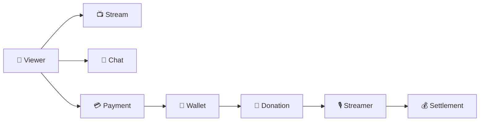

<div align="center">

# ⚡ RAIO Project

### Backend Engineering × AI × Scalable Architecture

일반적인 Backend Engineering을 기반으로  
**AI를 개발과 서비스에 활용하며 함께 성장하는 개발팀입니다.**

</div>

<br/>

> ### 👋 About Us
>
> RAIO는 단순히 기능을 구현하는 것보다  
> **왜 이렇게 설계하는지 고민하고, 그 경험을 팀의 기술로 축적하는 것**을 중요하게 생각합니다.

<br/>

<table>
<tr>
<td width="8%" align="center">
🚀
</td>
<td width="92%">

<b>기술을 따라가기보다, 이해하고 선택할 수 있는 팀을 지향합니다.</b><br/>
<sub><i>Build together · Learn together · Scale together</i></sub>

</td>
</tr>
</table>

<br/>

<details>
<summary><b>👀 RAIO가 지향하는 Engineering Culture</b></summary>

<br/>

우리는 새로운 기술을 단순히 적용하는 것보다  
**왜 필요한지 이해하고, 현재 문제에 적합한 기술을 선택하는 과정**을 중요하게 생각합니다.

- Backend Engineering을 중심으로 탄탄한 기반을 만듭니다.
- AI를 개발 생산성과 실제 서비스에 적극적으로 활용합니다.
- 기술 선택의 이유를 설명할 수 있는 엔지니어링을 지향합니다.
- 개인의 경험을 팀의 기술 자산으로 축적합니다.
- 서비스의 성장과 함께 개발자의 성장도 중요하게 생각합니다.

</details>

---

# 🏗️ Architecture Direction

> **Architecture should grow with the Service and the Team.**

RAIO는 처음부터 복잡한 Microservice Architecture를 구성하지 않습니다.

초기에는 **Monolith / Monorepo**의 생산성을 활용하면서  
각 비즈니스의 **Domain Boundary를 명확하게 유지**합니다.

<br/>

<div align="center">

**Package　→　Module　→　Runtime　→　Service　→　Repository**

</div>

<br/>

<table>
<tr>
<td width="8%" align="center">
🧩
</td>
<td width="92%">

<b>처음부터 분리하지 않습니다.</b><br/>
<sub>현재 규모에 적합한 구조에서 시작하고, 필요한 순간에 분리할 수 있는 경계를 설계합니다.</sub>

</td>
</tr>
</table>

<br/>

<details>
<summary><b>🏛️ Architecture Direction 자세히 보기</b></summary>

<br/>

## Domain First

RAIO는 Layer보다 **Domain을 중심으로 관련 코드를 응집**시키고,  
각 Domain 내부에서 Hexagonal Architecture를 유지합니다.

```text
payment-service
│
├── payment
│   ├── domain
│   ├── application
│   └── adapter
│
├── wallet
│   ├── domain
│   ├── application
│   └── adapter
│
└── settlement
    ├── domain
    ├── application
    └── adapter
```

이를 통해 다음을 지향합니다.

`High Cohesion` · `Low Coupling` · `Clear Boundary` · `Easy Extraction`

---

## Business & Runtime Separation

비즈니스 기능과 실행 환경(Runtime)을 서로 다른 관심사로 바라봅니다.

```text
        Business Capability

Payment · Wallet · Settlement · Stream
                 │
                 │ UseCase
                 ▼
──────────────────────────────────
                 ▲
                 │
      Online · Batch · Consumer

                Runtime
```

Domain은 **무엇을 수행하는지**를 정의하고,  
Runtime은 **어떻게 실행할지**를 결정합니다.

따라서 동일한 Application / Domain을  
Online Server, Batch Server, Consumer Server 등 다양한 실행 환경에서 재사용할 수 있습니다.

---

## Growing Architecture

RAIO는 서비스와 조직의 성장에 따라 경계를 점진적으로 확장합니다.

```text
Monolith / Monorepo
        │
        ▼
  Domain Boundary
        │
        ▼
      Package
        │
        ▼
      Module
        │
        ▼
      Runtime
        │
        ▼
      Service
        │
        ▼
    Repository
        │
        ▼
 Independent Team
```

처음부터 시스템을 분산시키는 것이 아니라,  
**필요할 때 분리할 수 있는 구조를 만드는 것**을 목표로 합니다.

</details>

---

# 🚀 Our Projects

> **아이디어를 실제 서비스로 만들며 기술을 검증합니다.**

<br/>

<table>
<tr>
<td width="100%" valign="top">

### 📡 RAIO Streaming

**Social Live Streaming Platform**

실시간 방송을 중심으로 시청자와 스트리머가  
**Streaming · Chat · Donation**을 통해 상호작용하는 소셜 스트리밍 플랫폼입니다.

<br/>

<table>
<tr>

<td width="25%" valign="top">

<b>🧩 Core Domain</b>

<br/>

`User`  
`Stream`  
`Chat`  
`Donation`  
`Payment`  
`Wallet`  
`Settlement`

</td>

<td width="25%" valign="top">

<b>⚙️ Backend</b>

<br/>

`Java 21`  
`Spring Boot 3`  
`JPA`  
`QueryDSL`  
`Spring Batch`

</td>

<td width="25%" valign="top">

<b>🗄️ Data & Communication</b>

<br/>

`PostgreSQL`  
`Redis`  
`Flyway`  
`REST`  
`gRPC`

</td>

<td width="25%" valign="top">

<b>☁️ Infrastructure</b>

<br/>

`Docker`  
`Railway`  
`GitHub Actions`  
`Prometheus`  
`Grafana`

</td>

</tr>
</table>

<br/>

### → [Explore RAIO Backend](https://github.com/RAIO-Project/raio-backend)

</td>
</tr>
</table>

<br/>

<details>
<summary><b>📡 RAIO Streaming Platform 자세히 보기</b></summary>

<br/>

## 🎬 Platform Flow



RAIO에서 시청자는 방송을 시청하며 실시간 채팅에 참여하고,  
포인트를 충전해 스트리머에게 후원할 수 있습니다.

후원으로 발생한 스트리머의 수익은  
정산 과정을 통해 집계되고 정산 대상 금액으로 확정됩니다.

---

## 🧩 Core Domains

| Domain | Responsibility |
|---|---|
| 👤 **User** | 회원, 인증 및 사용자 정보 관리 |
| 📺 **Stream** | 방송 생성 및 스트리밍 상태 관리 |
| 💬 **Chat** | 실시간 채팅 및 방송 상호작용 |
| 🎁 **Donation** | 시청자와 스트리머 간 후원 |
| 💳 **Payment** | 결제 및 포인트 충전 |
| 👛 **Wallet** | 사용자 포인트 잔액 및 거래 이력 |
| 💰 **Settlement** | 스트리머 수익 집계 및 정산 |

각 도메인은 자신의 비즈니스 책임을 가지며  
다른 도메인의 내부 구현에 직접 의존하지 않는 것을 지향합니다.

---

## 💰 Payment → Donation → Settlement

RAIO에서는 **Payment와 Settlement를 서로 다른 비즈니스 영역**으로 바라봅니다.

```text
Payment ≠ Settlement
```

### Payment

사용자가 플랫폼에 돈을 지불하고 포인트를 충전하는 과정입니다.

```text
Viewer
   │
   ▼
Payment
   │
   ▼
Wallet
```

### Donation

사용자가 보유한 포인트를 사용하여 스트리머에게 후원합니다.

```text
Viewer Wallet
      │
      ▼
   Donation
      │
      ▼
Streamer Revenue
```

### Settlement

후원 등을 통해 발생한 스트리머 수익을 집계하고  
플랫폼 수수료 정책을 적용하여 최종 정산 대상 금액을 계산합니다.

```text
Streamer Revenue
       │
       ▼
 Gross Amount
       │
       ▼
  Fee Policy
       │
       ▼
 Platform Fee
       │
       ▼
Net Settlement Amount
```

정산과 실제 지급은 분리합니다.

```text
Donation
    │
    ▼
Settlement
    │
    ▼
Payout / Transfer
```

현재 RAIO에서는 Settlement까지를 정산 도메인의 책임으로 정의하고,  
실제 송금이 필요한 시점에는 별도의 `Payout / Transfer` 영역으로 확장할 수 있도록 설계합니다.

---

## ⚙️ Batch Architecture

RAIO에서는 Batch 자체에 비즈니스 로직을 넣지 않습니다.

```text
Batch Server
     │
     ▼
Batch Adapter
     │
     ▼
UseCase
     │
     ▼
Application
     │
     ▼
Domain
```

예를 들어 정산 Batch는 정산 로직을 직접 구현하지 않고  
Settlement Application의 UseCase를 호출합니다.

```text
Settlement Job
      │
      ▼
SettlementCalculateUseCase
      │
      ▼
Settlement Application
      │
      ▼
Settlement Domain
```

> **Spring Batch를 사용하는 것이 목적이 아니라,  
> 도메인 개발자가 비즈니스에 집중할 수 있도록 Batch 실행 환경을 추상화하는 것을 목표로 합니다.**

---

## 🔌 Inter-Service Communication

서비스 간 통신에서도 Domain과 Application이  
특정 통신 기술에 직접 의존하지 않도록 설계합니다.

```text
Application
     │
     ▼
    Port
     │
     ▼
gRPC Adapter
     │
     ▼
   gRPC
     │
     ▼
Server Adapter
     │
     ▼
Application
```

현재 서비스 간 동기 통신에는 `gRPC`를 활용하며,  
향후 비동기 처리가 필요한 영역은 Event 기반 통신으로 확장할 수 있도록 고려합니다.

</details>

---

# 🛠️ Technology

<div align="center">

### Backend

`Java 21` · `Spring Boot 3` · `Spring Batch` · `JPA` · `QueryDSL`

### Data

`PostgreSQL` · `Redis` · `Flyway`

### Communication

`REST API` · `gRPC`

### Infrastructure

`Docker` · `Railway` · `GitHub Actions`

### Observability

`Prometheus` · `Grafana`

</div>

---

<div align="center">

## ⚡ RAIO Project

**Build together · Learn together · Scale together**

`Backend`　·　`Architecture`　·　`AI`　·　`Streaming`

</div>
